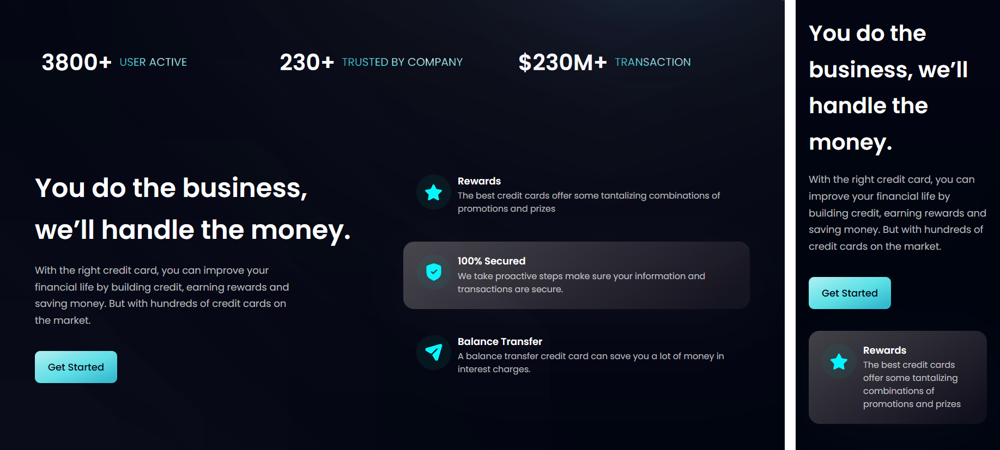
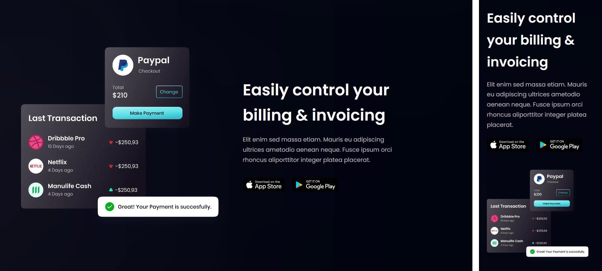
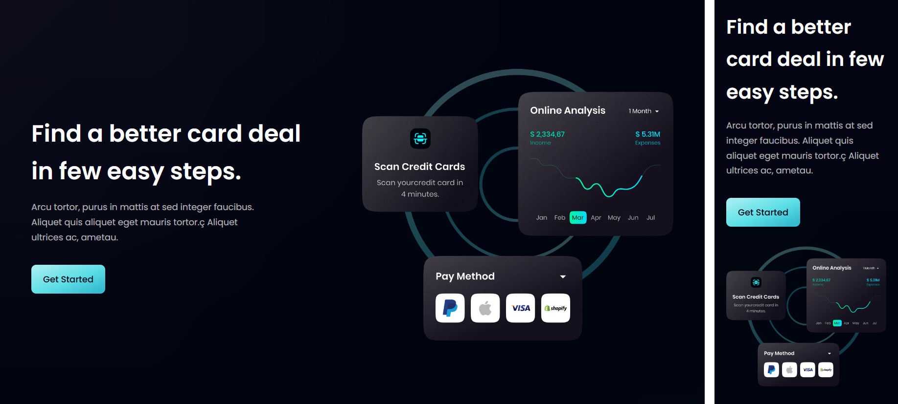
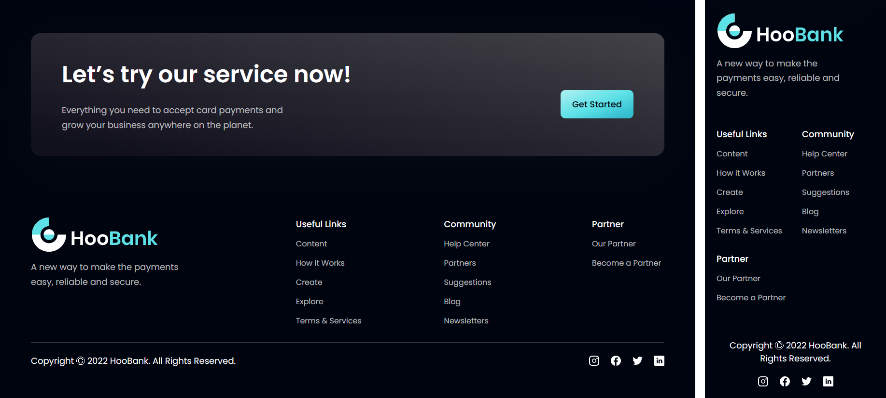

# HooBank


A re-creation of a modern front-end UI/UX web design with the theme of a digital payment service, built with:

- [Next.js](https://nextjs.org/docs)
- [React](https://reactjs.org/docs/getting-started.html)
- [Tailwind CSS](https://tailwindcss.com/)

**See it [LIVE](https://hoobank-site-larryh12.vercel.app/)** 👈

## Design Breakdown

### Landing Section


#### Navbar Comp

This comp will be rendered as a client component as we will be using `{ useState }` hook from React to set the active nav link. Addtionally, we will be using the `<Image />` comp from `'next/image'` to optimise image render.

```js
'use client';

import { useState } from 'react';
import Image from 'next/image';
```

By default, we set the currently active link to the `Home` section of our page.

```js
const [active, setActive] = useState('Home');
```

The `<Navbar />` comp layout consists of a svg logo and an unordered list of `navLinks`

```js
<nav className="container">
  <Image src={logo} alt="hoobank" />
  <ul className="hidden sm:flex">
    {navLinks.map((nav, index) => (
      <li
        key={nav.id}
        className={`${active === nav.title ? 'text-white' : 'text-dimWhite'} ${
          index === navLinks.length - 1 ? 'mr-0' : 'mr-10'
        }`}
        onClick={() => setActive(nav.title)}
      >
        <a href={`#${nav.id}`}>{nav.title}</a>
      </li>
    ))}
  </ul>
</nav>
```

- In the `<li>` element, we check for the `active` item with `nav.title`. Non-active elements will have a dimmer `text-dimWhite` colour.
- We will also look for the last item by checking for `index === navLinks.lengh - 1`. The last item should not have any right margin `mr-0`.
- The `onClick()` callback is use to set the state of the active nav item.

To add a hamburger menu for small screen display, we add another div container and set the `sm` breakpoint for it to display on small screen size, and also set the `<ul>` element above to `hidden`.

We also need to set another state to toggle the hamburger menu.

```js
const [toggle, setToggle] = useState(false);
```

```js
<div className="hamburger_container flex sm:hidden">
  <Image
    src={toggle ? close : menu}
    alt="hamburger_icon"
    onClick={() => setToggle((prev) => !prev)}
  />
  <div className={`${toggle ? 'flex' : 'hidden'} bg-black-gradient sidebar`}>
    <ul className="flex-col">
      {'similar'}
      {'to above'}
    </ul>
  </div>
</div>
```

- By default, the menu is not collapsed as we set the initial `toggle` state to `useState(false)`.
- The `onClick()` callback will switch between the toggle states `setToggle((prev) => !prev)`.
- The `toggle` state will be checked to render the `hamburger_icon` and to collapse the nav menu.
- Inside the menu, we use the same `<ul>` code as before, but change only the flex direction to column `flex-col`.
- The menu has a gradient background with a custom css class `bg-black-gradient` and a slide-up animation class `sidebar`.

#### Hero Section

This section mainly consists of 2 part: left and right. The right section is just simply a graphic image `robot.png` with several gradient divs and custom position styles.

```js
<div className="pink__gradient absolute top-0 z-[0] h-[35%] w-[40%]" />
<div className="white__gradient absolute bottom-40 z-[1] h-[80%] w-[80%] rounded-full" />
<div className="blue__gradient absolute bottom-20 right-20 z-[0] h-[50%] w-[50%]" />
```

We will be focusing on the left section.

```js
<div className="left_section_container">
  /* discount bar */
  <div className="discount_bar_container bg-discount-gradient">
    <Image src={discount} alt="discount" />
    <p className="discount_text">discount_text</p>
  </div>
  /* heading text upper*/
  <div className="heading_text_upper">
    <div className="get_started_button"></div>
  </div>
  /* heading text lower*/
  <h1 className="heading_text_lower">heading_text_lower</h1>
  /* paragraph text */
  <p className="paragraph_text">paragraph_text</p>
</div>
```

- This section is split into 3 parts: a discount bar on the top, an upper heading text with gradient color and a CTA button, a lower text content.
- The `discount_bar` has `bg-discount-gradient` custom style as background, and `rounded-[10px]` in 4 corners.
- The `heading_text_upper` has `text-gradient` as custom gradient style for the text. We set the gradient as background colour, then set it to clip to the foreground text and set the text fill to pass the colour to foreground.

  ```css
  .text-gradient {
    background: radial-gradient(/* colours */);
    -webkit-background-clip: text;
    -webkit-text-fill-color: transparent;
    background-clip: text;
    text-fill-color: transparent;
  }
  ```

- The `get_started` button is simply a `rounded_full` container with children text nodes. The texts also use the same `text-gradient` styles as above.
- On small screen display, the button nested inside the upper section is set to `hidden`, but rather displayed as `flex` at the bottom of the lower text section.

### Features Section



#### Section Layout

```js
<section id="features" className="section_container">
  <div className="left_section">
    <h2 className="heading_text">heading_text</h2>
    <p className="paragraph_text">paragraph_text</p>

    <button className="bg-blue-gradient">Get Started</button>
  </div>

  <div className="right_section">
    {features.map((feature, index) => (
      <FeatureCard key={feature.id} {...feature} index={index} />
    ))}
  </div>
</section>
```

#### FeatureCard Comp

```js
const FeatureCard = ({ icon, title, content, index }) => (
  <div
    className={`feature_card_container ${
      index === features.length - 1 ? 'mb-0' : 'mb-6'
    }`}
  >
    <div className="icon_container bg-dimBlue">
      <Image src={icon} className="feature_icon" />
    </div>
    <div className="text_container">
      <h4 className="feature_title">{title}</h4>
      <p className="feature_content">{content}</p>
    </div>
  </div>
);
```

### Billing Section



#### Section Layout

```js
<section className="section_container">
  <div className="left_section">
    <Image src={bill} className="cool_graphic" />
    {/* gradient start */}
    <div className="white__gradient" />
    <div className="pink__gradient" />
    {/* gradient end */}
  </div>
  <div className="right_section">
    <h2 className="heading_text">heading_text</h2>
    <p className="paragraph_text">paragraph_text</p>
    <div className="app_store_container">
      <Image src={apple} />
      <Image src={google} />
    </div>
  </div>
</section>
```

### Card Deal Section



#### Section Layout

```js
<section className="section_container">
  <div className="left_section">
    <h2 className="heading_text">heading_text</h2>
    <p className="paragraph_text">paragraph_text</p>
    <button type="button" className="bg-blue-gradient get_started">
      Get Started
    </button>
  </div>

  <div className="right_section">
    <Image src={card} className="cool_graphic" />
  </div>
</section>
```

### Testimonials Section


#### Section Layout

```js
<section id="clients" className="section_container">
  <div className="blue__gradient" />

  <div className="top_text_container">
    <h2 className="heading_text">heading_text</h2>
    <div className="paragraph_container">
      <p className="paragraph_text">paragraph_text</p>
    </div>
  </div>

  <div className="feedback_container">
    {feedback.map((card, index) => (
      <FeedbackCard key={card.id} {...card} index={index} />
    ))}
  </div>
</section>
```

#### FeedbackCard Comp

```js
const FeedbackCard = ({ content, name, title, img, index }) => (
  <div className={`container`}>
    <Image src={quotes} className="quotes_icon" />
    <p className="feedback_content">{content}</p>

    <div className="people_container">
      <Image src={img} className="people_avatar" />
      <div className="people_details_container">
        <h4 className="people_name">{name}</h4>
        <p className="people_title">{title}</p>
      </div>
    </div>
  </div>
);
```

### Footer Section



#### CTA Layout

```js
<section className="bg-black-gradient-2 CTA_container">
  <div className="text_container">
    <h2 className="heading_text">heading_text</h2>
    <p className="paragraph_text">paragraph_text</p>
  </div>

  <div className="button_container">
    <button type="button" className="bg-blue-gradient">
      Get Started
    </button>
  </div>
</section>
```

#### Footer Layout

```js
<section className="section_container">
  <div className="top_container">
    <div className="logo_container">
      <Image src={logo} />
      <p className="paragraph_text">paragraph_text</p>
    </div>
    <div className="links_container">
      {footerLinks.map((footerlink) => (
        <div key={footerlink.title} className="link_group_container">
          <h4 className="link_group_title">{footerlink.title}</h4>
          <ul className="link_item_ul">
            {footerlink.links.map((link, index) => (
              <li className={`link_item text-dimWhite hover:text-secondary`}>
                {link.name}
              </li>
            ))}
          </ul>
        </div>
      ))}
    </div>
  </div>

  <div className="bottom_container">
    <p className="paragraph_text">Copyright Ⓒ 2022 HooBank</p>
    <div className="social_icons_container">
      {socialMedia.map((social, index) => (
        <Image
          key={social.id}
          src={social.icon}
          alt={social.id}
          className={`social_logo`}
        />
      ))}
    </div>
  </div>
</section>
```

<details>
<summary>Credits</summary>

[@adrianhajdin GitHub Repo](https://github.com/adrianhajdin/project_hoobank) |
[One Week Wonders Figma Design](https://www.figma.com/file/bUGIPys15E78w9bs1l4tgS)

</details>
