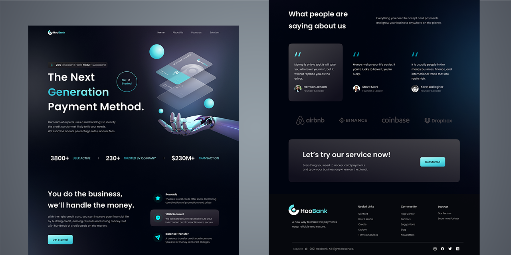

# HooBank

A re-creation of a modern front-end UI/UX web design with the theme of a digital payment service, built with:

- [Next.js](https://nextjs.org/docs)
- [React](https://reactjs.org/docs/getting-started.html)
- [Tailwind CSS](https://tailwindcss.com/)

**See it [LIVE](https://hoobank-site-larryh12.vercel.app/)** 👈

## Design Breakdown

### Landing Section

Credits

[@adrianhajdin GitHub Repo](https://github.com/adrianhajdin/project_hoobank) |
[One Week Wonders Figma Design](https://www.figma.com/file/bUGIPys15E78w9bs1l4tgS)

